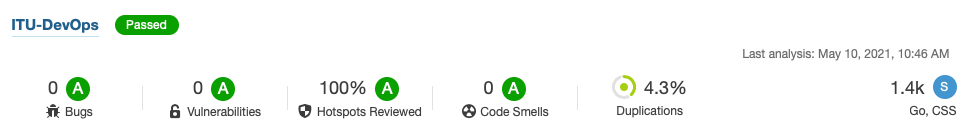

# System

## Overview

The core of the Minitwit application is written in Go. It is split into a frontend system that responds to HTTP requests coming in on destination port 8080 and a backend API that responds to HTTP requests received on port 8081. The frontend system responds to client GET requests with properly formatted HTML responses and is what users would interact with when they visit our website. The backend system responds only with raw JSON and is what the simulator interacts with. The two systems share a PostgreSQL database that stores user information, user following relationships, messages and the 'latest' value. The systems interface with the database through the ORM library GORM instead of through raw SQL queries. The systems are instrumented with Prometheus metrics which allows us to monitor them using Grafana. 

## Dependencies

### Production environment

The production system is deployed to three nodes on DigitalOcean. One node acts as a manager and load balancer and the other two are replicated worker nodes. The nodes are managed with Docker Swarm. The runtime environment of the worker nodes are Docker containers running Ubuntu v. 20.4. DigitalOcean was chosen as the cloud provider for the following reasons:

- They have a very affordable pricing model, especially for smaller projects such as Minitwit. Additionally, the GitHub student pack offered a 100$ credit.
- They have a comprehensive set of tutorials and guides and really nice documentation.
- Their web interface is very intuitive.

We chose Docker Swarm as the cluster orchestration technology because

- As Swarm is a Docker product, it uses the standard Docker API and networking. Since we were already virtualizing our production environment using Docker and Docker Compose, the transition to Swarm was relatively painless.
- It has a lightweight installing and is simple to deploy as Swarm mode is already included in the Docker engine.
- *Maybe more*

### Technologies and subsystems

On a high level, the whole system depends on the following technologies:

- **Go**

  As previously mentioned, the two main applications were written in Go. The decision to go with Go was based on the following facts:

  - Go is a fast, minimalistic and scalable language with an extensive standard library.
  - It has a strong static type system which helps to minimize bugs. This is an advantage over Python, in which the original Minitwit application was written.
  - Concurrency is an integral part of the language and is supported through goroutines and channels.
  - Programs are constructed from packages which offers clear code separation.

- **PostgreSQL**

  PostgreSQL is the database for the project. We decided to use PostgreSQL because

  - It supports concurrency while still adhering to the ACID principles.
  - It is one of the most popular DBMSs in the world. This makes it easy to find help online.
  - It is free to use.

- **GORM**

  GORM is our object-relational mapping (ORM) library that we use to abstract our database into objects in Go. We chose GORM because

  - It is a full-featured ORM library for Go with many different different association types.
  - It integrates well with our PostgreSQL database.
  - It has built-in support for Prometheus.
  - It has a rich, extensive documentation which makes bug-hunting less painful.

- **GitHub Actions**

  CI/CD is handled with GitHub Actions. Actions was chosen for the following reasons:

  - As Actions is a GitHub product, it integrates very well with our GitHub repository.
  - It is relatively straight-forward to setup compared to other CI/CD solutions. Many common processes ('Actions') have already been implemented by GitHub themselves or other developers.
  - It is free to use up to 2000 minutes per month.

- **Prometheus/Grafana**

  The Go applications are both instrumented with Prometheus metrics, which are then visualized in Grafana. These two technologies were chosen based on the following reasons:

  - The combination of Prometheus and Grafana is an industry standard for monitoring Go applications. Additionally, it is relatively straightforward to connect Prometheus to Grafana.
  - Prometheus delivers metrics without creating time lag on performance.
  - They both exist as Docker images in Docker Hub, which makes deployment easy. 
  - Grafana offers very customizable dashboards for visualizing application performance.

- **SonarQube**

  The codebase is statically analyzed by SonarQube. The reasons we went with SonarQube are

  - SonarQube is very feature-packed. It has support for identification of duplicated code, unit testing, code complexity, code smells and much more.
  - It integrates well with popular IDEs such as Eclipse and Visual Studio.

### Go libraries

On the lowest level, our Go applications depend on the following libraries:

- **fmt** - used for string formatting and basic I/O.
- **errors** - useful functions for error handling and error manipulation .
- **os** - used to interface with the operating system. We use this to obtain environment variables.
- **encoding/json** - used to encode code objects as JSON strings.
- **strconv** - conversion to and from string representations
- **strings** - string manipulation
- **time** - used for function execution timing.
- **net/http** - used to listen for HTTP requests and serve responses.
- **log** - used for basic logging of our application. We log system errors and HTTP requests and responses.
- **gorilla/mux** - used to implement request routing. We use mux to direct specific requests to appropriate handler functions.
- **gorilla/sessions** - provides a cookie system.
- **godotenv** - used to read environment variables from a file.
- **gorm** - Gorm is the ORM library that we use to abstract the database to objects in code.
- **postgres** - used by Gorm to interact with the database.
- **prometheus** - prometheus is our metrics system that stores information about numbers of requests per endpoint as well as function execution times.
- **promhttp** - this submodule of prometheus is used to expose an endpoint called /metrics that is used by Grafana.
- **bcrypt** - used to hash passwords.
- **html/template** - used for generating valid HTML from templates

## Current state of system

### Code base

We use the static analysis service SonaryQube for automatic code review. After removing unnecessary files and refactoring the system, we received the the following ratings from SonarQube:

This indicates that our system is relatively bug-free. 

## License

After reviewing all our dependencies, we found the following six different licenses that our license had to comply with:

- PostgrSQL License
  - a permissive license that allows anyone to use, copy, modify and distribute PostgreSQL.
- MIT License
  - A very permissive license with high license compatibility.
- Apache License 2.0
  - a permissive, free software license.
- AGPLv3
  - a free software license. However, this has a strong copyleft clause, which requires us to use AGPLv3 for our project as well.
- GNU Lesser General Public License
  - General permissive license
- BSD-3-Clause License - very permissive license.

Because of the copyleft clause of AGPLv3, we used that as our license.